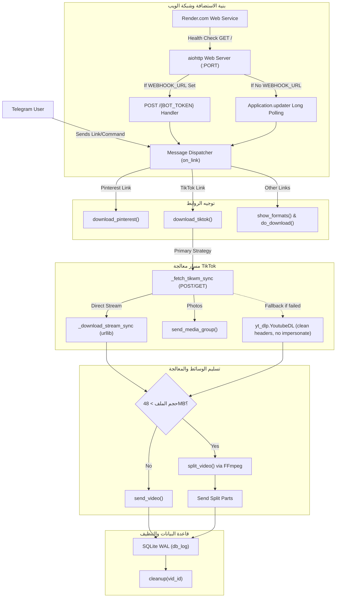

# 🧠 ذاكرة الرسم البياني للمشروع (Project Graph Memory)

## 📌 معلومات المشروع الأساسية
- **اسم المشروع:** YAMD (Yet Another Media Downloader)
- **المطور الرئيسي:** يعقوب المهاجري (@Yaaqob_Almahajeri)
- **الإصدار الحالي:** 1.2.2
- **البيئة المستهدفة:** Python 3.11+, Telegram Bot API (Async), Linux/Docker
- **بيئة الاستضافة المدعومة:** Render.com (Web Service - Hybrid Polling/Webhook)

---

## 🗺️ الرسم البياني للمكونات والعلاقات (Component Graph)

---

## 🔗 سجل العلاقات بين الملفات والمكتبات (Node Dependencies)

| العقدة (Node) | الاعتماديات الأساسية (Dependencies) | المخرجات / التأثير |
| :--- | :--- | :--- |
| `bot.py` | `python-telegram-bot`, `yt-dlp`, `curl_cffi`, `ffmpeg`, `sqlite3`, `aiohttp` | تشغيل البوت وإدارة الطلبات المتزامنة وخدمة المنفذ للبيئة السحابية |
| `main` (Server) | `aiohttp.web`, `Application.updater` | فتح المنفذ الفوري لـ Render مع دعم Webhook أو Polling تلقائياً |
| `_fetch_tikwm_sync` | `urllib.request`, `urllib.parse`, `json` | استخراج روابط MP4 الأصلية بدون علامة مائية |
| `download_tiktok` | `_fetch_tikwm_sync`, `yt-dlp.YoutubeDL` | معالجة وتنزيل مقاطع تيك توك بأمان وتفادي AssertionError |
| `split_video` | `ffmpeg`, `ffprobe` | تقسيم المقاطع الأكبر من 48MB لأجزاء متوافقة مع تلغرام |
| `db_log` | `sqlite3` (WAL Mode) | تسجيل عمليات التحميل وإحصائيات المستخدمين |

---

## 🕒 سجل التعديلات المحدثة (State History)
- **2026-09-05 (v1.2.2):** حل مشكلة `Port scan timeout` على Render.com بربط خادم الويب فورياً على `$PORT` وتوفير دعم هجين (Hybrid) لـ Webhook و Polling ليعمل بسلاسة ومجاناً كـ Web Service.
- **2026-09-05 (v1.2.1):** إصلاح انهيار `AssertionError` في تيك توك عبر إزالة `impersonate` من الـ fallback وتعزيز TikWM بطلبات POST المباشرة.
