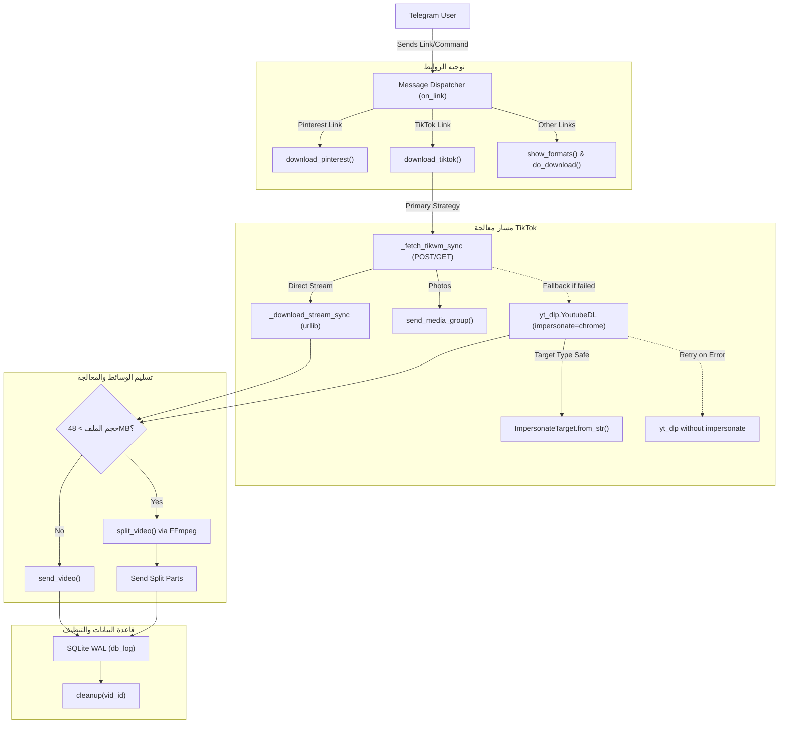

# 🧠 ذاكرة الرسم البياني للمشروع (Project Graph Memory)

## 📌 معلومات المشروع الأساسية
- **اسم المشروع:** YAMD (Yet Another Media Downloader)
- **المطور الرئيسي:** يعقوب المهاجري (@Yaaqob_Almahajeri)
- **الإصدار الحالي:** 1.2.1
- **البيئة المستهدفة:** Python 3.11+, Telegram Bot API (Async), Linux/Docker

---

## 🗺️ الرسم البياني للمكونات والعلاقات (Component Graph)

---

## 🔗 سجل العلاقات بين الملفات والمكتبات (Node Dependencies)

| العقدة (Node) | الاعتماديات الأساسية (Dependencies) | المخرجات / التأثير |
| :--- | :--- | :--- |
| `bot.py` | `python-telegram-bot`, `yt-dlp`, `curl_cffi`, `ffmpeg`, `sqlite3` | تشغيل البوت وإدارة الطلبات المتزامنة |
| `_fetch_tikwm_sync` | `urllib.request`, `urllib.parse`, `json` | استخراج روابط MP4 الأصلية بدون علامة مائية |
| `download_tiktok` | `_fetch_tikwm_sync`, `yt-dlp.YoutubeDL`, `ImpersonateTarget` | معالجة وتنزيل مقاطع تيك توك بأمان وتفادي AssertionError |
| `split_video` | `ffmpeg`, `ffprobe` | تقسيم المقاطع الأكبر من 48MB لأجزاء متوافقة مع تلغرام |
| `db_log` | `sqlite3` (WAL Mode) | تسجيل عمليات التحميل وإحصائيات المستخدمين |

---

## 🕒 سجل التعديلات المحدثة (State History)
- **2026-09-05:** إصلاح انهيار `AssertionError` الناتج عن تمرير سلسلة نصية لخيار `impersonate` في `yt-dlp`، وتحديثه لـ `ImpersonateTarget.from_str("chrome")` مع آلية Fallback مرنة ودعم POST لـ TikWM.
